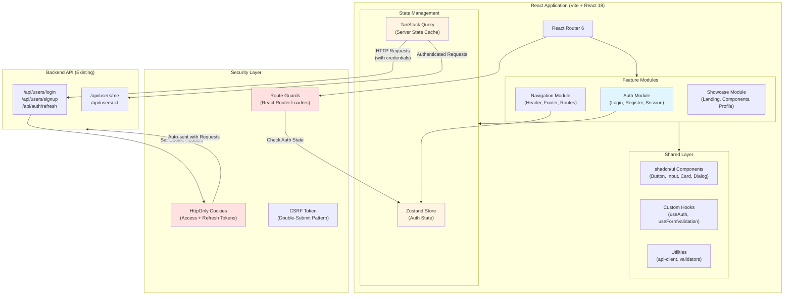
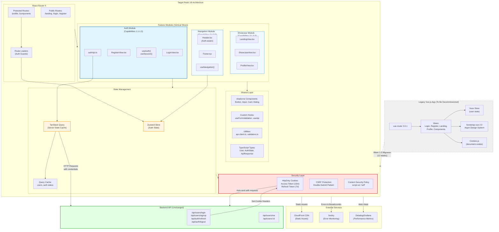
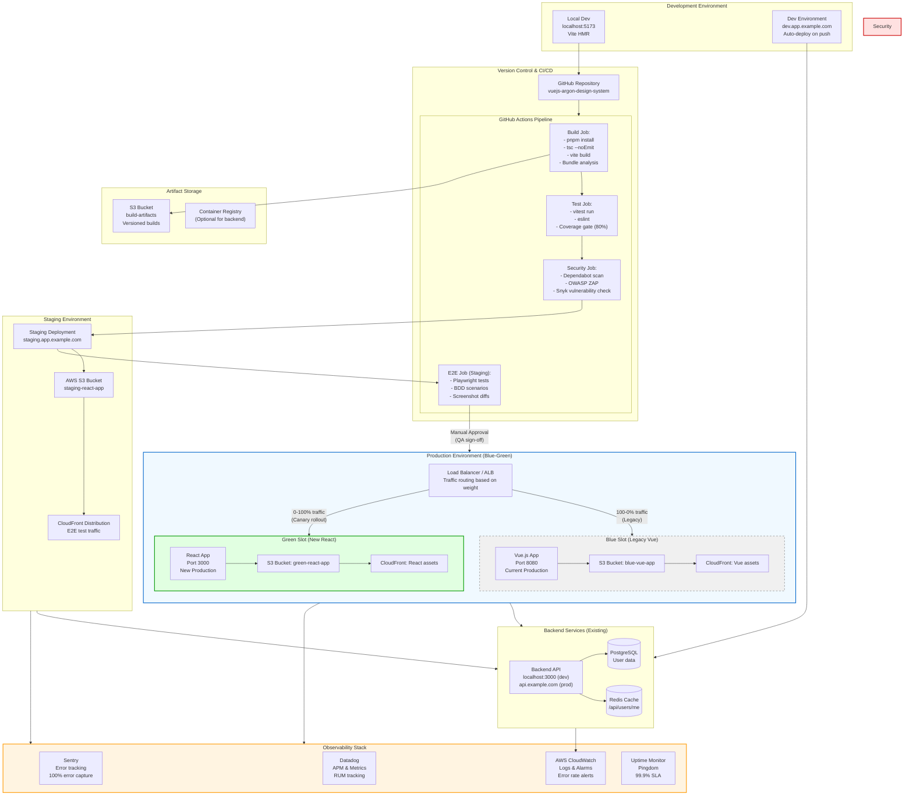

# VueJS Argon Design System — React Modernization Approach

## Executive Summary

This document outlines the migration strategy for transforming a **Vue.js 2.5.16 authentication starter kit** into a **modern React 18+ application** with production-grade security, scalability, and maintainability. The legacy system is a single-page application (SPA) showcasing the Argon Design System with JWT authentication, built on Vue CLI 3.x, Bootstrap-Vue, and Vuex.

**Migration Scope**: 6 views, 1 Vuex store, 6 routes, 15+ base components, 3 critical security vulnerabilities.

**Target Timeline**: 8-12 weeks across 3 migration waves.

---

## 1. TARGET ARCHITECTURE

### 1.1 Architecture Pattern: **Modular Monolith with Vertical Slices**

**Justification**:
- Current system has only **6 capabilities** across 3 domains (Stage 3 analysis)
- No evidence of independent scaling requirements per capability
- Team likely small (starter kit project with 244 files)
- Microservices would introduce unnecessary operational complexity

**Structure**:
```
src/
├── features/              # Vertical slices by business capability
│   ├── auth/             # Login, Register, Session (Capabilities 1.1-1.3)
│   │   ├── components/   # AuthForm, LoginView, RegisterView
│   │   ├── hooks/        # useAuth, useSession
│   │   ├── services/     # authApi.ts
│   │   └── store/        # authSlice.ts (Zustand)
│   ├── navigation/       # Routing, Header, Footer (Capabilities 2.1-2.2)
│   └── showcase/         # Landing, Components, Profile (Capabilities 3.1-3.2)
├── shared/
│   ├── components/       # Button, Input, Card, Modal (design system)
│   ├── hooks/            # useFormValidation, useCookie
│   ├── utils/            # validators, api-client
│   └── types/            # TypeScript interfaces
├── app/
│   ├── routes/           # React Router configuration
│   ├── providers/        # AuthProvider, ThemeProvider
│   └── layout/           # RootLayout, AuthLayout
└── config/               # Environment variables, constants
```

**Service Boundaries** (aligned with Stage 3 Capability Map):

| Domain | Capabilities | Module | Upstream Dependencies |
|--------|--------------|--------|----------------------|
| **User Identity** | 1.1 Registration, 1.2 Authentication, 1.3 Session | `features/auth` | Backend API, Cookie Service |
| **Navigation & UX** | 2.1 Route Management, 2.2 UI State | `features/navigation` | Auth Store |
| **Marketing** | 3.1 Design Showcase, 3.2 CTAs | `features/showcase` | None |

---

### 1.2 Technology Stack

#### **Frontend Framework**
- **React 18.3+** with **Vite 5.x** (not Next.js — justification in Section 5.1)
- **Rendering Strategy**: Client-Side Rendering (CSR)
  - **Rationale**: Legacy app is pure SPA with no SEO requirements (marketing site is external at appseed.us)
  - SSR overhead not justified for authenticated dashboard use case

#### **State Management**
- **Zustand 4.x** for global state (authentication, user session)
  - **Rationale**: Vuex store is trivial (2 mutations, 2 actions) — Redux is overkill
  - Zustand provides 90% less boilerplate than Redux for simple auth state
- **TanStack Query (React Query) 5.x** for server state
  - Handles API caching, revalidation, optimistic updates
  - Eliminates manual loading/error state management
- **React Context API** for theme/layout preferences (non-critical state)

**Vuex → Zustand Migration Mapping**:

| Vuex Concept | React Equivalent | Example |
|--------------|------------------|----------|
| `state.user` | `useAuthStore().user` | `const user = useAuthStore((s) => s.user)` |
| `mutations.LOGIN` | `authStore.setUser(user)` | Direct state mutation in Zustand |
| `actions.LOGIN` | `authStore.login(user)` | Async actions as store methods |
| `mapState`, `mapActions` | Custom hooks | `useAuth()` hook wraps store selectors |

#### **Routing**
- **React Router 6.x** (not TanStack Router — proven, stable, large ecosystem)
- **Migration from vue-router**:

| Vue Router Feature | React Router Equivalent |
|--------------------|-------------------------|
| `routes` array | `createBrowserRouter([...])` |
| `scrollBehavior` | Custom `ScrollRestoration` component |
| Navigation guards | `loader` functions + `useAuth` hook |
| Named routes | Route `id` + `useNavigate` with paths |
| Hash mode | `createHashRouter` (deprecated, migrate to history mode) |

#### **UI Framework & Styling**
- **Tailwind CSS 3.x** + **shadcn/ui** (not MUI/Chakra — justification in Section 5.3)
  - shadcn/ui provides unstyled, accessible primitives (Radix UI foundation)
  - Tailwind replaces Bootstrap grid system and utilities
  - **Design System Migration**:
    - Argon Design System colors → Tailwind `theme.extend.colors`
    - Bootstrap `.btn-*` classes → `<Button variant="primary">` component
    - `.card`, `.modal` → shadcn/ui `Card`, `Dialog` primitives

**Component Migration Mapping**:

| Vue Component | React Equivalent | Library |
|---------------|------------------|----------|
| `BaseButton.vue` | `<Button>` | shadcn/ui |
| `BaseInput.vue` | `<Input>`, `<FormField>` | shadcn/ui + react-hook-form |
| `Modal.vue` | `<Dialog>` | shadcn/ui (Radix Dialog) |
| `Card.vue` | `<Card>` | shadcn/ui |
| `AppHeader.vue` | `<Header>` | Custom (uses shadcn/ui primitives) |
| `flatpickr` | `<Calendar>` or native `<input type="date">` | shadcn/ui (React DayPicker) |
| `nouislider` | `<Slider>` | shadcn/ui (Radix Slider) |
| `vue-lazyload` | `loading="lazy"` or React Suspense | Native HTML or React.lazy |

#### **Form Handling**
- **React Hook Form 7.x** (not Formik — better performance, smaller bundle)
- **Zod 3.x** for schema validation (replaces manual regex validation in `Login.vue`/`Register.vue`)

**Validation Migration Example**:

```typescript
// Vue (Login.vue lines 133-136)
validEmail: function(email) {
  const re = /^(([^<>()\[\]\\.,;:\s@"]+(\.[^<>()\[\]\\.,;:\s@"]+)*)|(".+"))@((\[[0-9]{1,3}\.[0-9]{1,3}\.[0-9]{1,3}\.[0-9]{1,3}\])|(([a-zA-Z\-0-9]+\.)+[a-zA-Z]{2,}))$/;
  return re.test(email);
}

// React (features/auth/schemas/loginSchema.ts)
import { z } from 'zod';
export const loginSchema = z.object({
  email: z.string().email('Invalid email format'),
  password: z.string().min(1, 'Password required')
});
```

#### **Authentication & Security**

**Critical Security Issues Resolved**:

| Legacy Vulnerability | Root Cause | Mitigation Strategy |
|---------------------|------------|---------------------|
| **No HttpOnly cookies** | `Cookies.js` uses `document.cookie` | **Backend sets HttpOnly cookie**; frontend never accesses token |
| **No JWT signature validation** | Client-side `jwt-decode` only | **Backend validates token** in middleware; frontend treats as opaque |
| **No token expiration check** | No expiration logic in `AppHeader.vue` | **TanStack Query auto-refreshes** on 401; refresh token rotation |
| **Hardcoded localhost URLs** | `Login.vue` line 163, `Register.vue` line 208 | **Environment variables** via Vite (`import.meta.env.VITE_API_URL`) |
| **No route guards** | All routes public (Stage 1 Rule 19) | **React Router loaders** check auth state; redirect to `/login` |
| **Insecure cookie flags** | Missing `Secure`, `SameSite` | **Backend sets** `Secure; HttpOnly; SameSite=Strict` |

**Target Authentication Architecture**:

```typescript
// features/auth/services/authApi.ts
import { apiClient } from '@/shared/utils/api-client';

export const authApi = {
  // Backend returns Set-Cookie header with HttpOnly token
  login: (credentials: LoginCredentials) => 
    apiClient.post('/api/users/login', { user: credentials }),
  
  // Refresh token via cookie (sent automatically)
  refreshToken: () => apiClient.post('/api/auth/refresh'),
  
  // Backend clears cookie
  logout: () => apiClient.post('/api/auth/logout'),
  
  // Validate session (backend reads HttpOnly cookie)
  getCurrentUser: () => apiClient.get('/api/users/me')
};

// features/auth/hooks/useAuth.ts
export function useAuth() {
  const { data: user, isLoading } = useQuery({
    queryKey: ['auth', 'currentUser'],
    queryFn: authApi.getCurrentUser,
    retry: false,
    staleTime: 5 * 60 * 1000 // 5 minutes
  });
  
  return { user, isAuthenticated: !!user, isLoading };
}
```

**Cookie Strategy**:
- **Access Token**: 15-minute expiration, HttpOnly, Secure, SameSite=Strict
- **Refresh Token**: 7-day expiration, HttpOnly, Secure, SameSite=Strict, separate `/refresh` endpoint
- **CSRF Protection**: Double-submit cookie pattern (CSRF token in non-HttpOnly cookie + header)

#### **API Design**
- **REST** (maintain compatibility with legacy backend)
- **Contract Strategy**: 
  - Normalize inconsistent payloads via API client middleware
  - Legacy: `POST /signup` uses `{name, surname, email, password}` while `/login` uses `{user: {email, password}}`
  - Solution: Adapter layer in `api-client.ts` transforms requests/responses

```typescript
// shared/utils/api-client.ts
const requestAdapters: Record<string, (data: any) => any> = {
  '/api/users/login': (data) => ({ user: data }),
  '/api/users/signup': (data) => ({ ...data, surname: data.surname || ' ' })
};
```

#### **Build Tooling**
- **Vite 5.x**: 10-20x faster HMR than Vue CLI 3 Webpack
- **TypeScript 5.x**: Type safety for forms, API contracts, state management
- **ESLint 9.x** + **Prettier**: Code quality
- **Vitest**: Unit tests (Jest-compatible, Vite-native)
- **Playwright**: E2E tests (replaces manual BDD scenario execution)

---

## 2. TARGET ARCHITECTURE DIAGRAM



---

## 3. MIGRATION STRATEGY

### 3.1 Overall Pattern: **Strangler Fig with Parallel Component Migration**

**Justification**:
- **Not Big Bang**: Too risky for 6 views with authentication dependencies
- **Not Pure Strangler Fig**: No need to run Vue + React simultaneously in production (no backend migration)
- **Hybrid Approach**: Migrate component-by-component in **isolated development environment**, then cutover per wave

**Key Principles**:
1. **No Dual Framework Runtime**: Rewrite entire feature module before deployment (no Vue + React interop)
2. **API Contract Frozen**: Backend API remains unchanged during frontend migration
3. **Feature Flagging**: Use environment variables to enable migrated routes progressively

---

### 3.2 Wave 1: Foundation & Shared Infrastructure (Weeks 1-3)

**Scope**: Non-user-facing infrastructure + Design System

**Pattern**: **Parallel Build (No Production Deployment)**

#### Components to Migrate:
1. **Build Tooling Setup**
   - Initialize Vite + React 18 + TypeScript
   - Configure Tailwind CSS with Argon theme colors
   - Set up ESLint, Prettier, Vitest

2. **Shared Components** (Stage 3 Capability 3.1 dependencies)
   - `BaseButton.vue` → `Button.tsx` (shadcn/ui)
   - `BaseInput.vue` → `Input.tsx` + `FormField.tsx`
   - `Card.vue` → `Card.tsx`
   - `Modal.vue` → `Dialog.tsx`
   - Icon system (Font Awesome 4 → Lucide React)

3. **Utility Layer**
   - `Cookies.js` → **Remove entirely** (backend handles cookies)
   - API client with axios + TanStack Query setup
   - Validation utilities (Zod schemas)

4. **Layout Components**
   - `AppFooter.vue` → `Footer.tsx` (static, no state dependencies)

#### State Migration:
- **N/A** (no global state in Wave 1)

#### Data Migration:
- **N/A** (no data persisted client-side beyond cookies)

#### Cutover Criteria:
- [ ] Storybook documentation for all shared components
- [ ] Visual regression tests pass (Chromatic or Percy)
- [ ] Bundle size ≤ 150KB gzipped (vs. Vue app ~180KB)
- [ ] Accessibility audit passes (axe-core)

#### Rollback Plan:
- Not applicable (no production deployment in Wave 1)

---

### 3.3 Wave 2: Authentication & Session Management (Weeks 4-6)

**Scope**: Capabilities 1.1, 1.2, 1.3 (Stage 3 Domain 1)

**Pattern**: **Feature Toggle with Staged Rollout**

#### Components to Migrate:

1. **Authentication Views**
   - `Login.vue` → `LoginView.tsx`
     - Replace manual validation with React Hook Form + Zod
     - Replace `Cookies.create()` with backend-set HttpOnly cookie
   - `Register.vue` → `RegisterView.tsx`
     - Remove hardcoded `surname: " "` logic (fix in backend or adapter)
     - Pre-populate email from query param (not cookie)

2. **Session Management**
   - `store/index.js` (Vuex) → `features/auth/store/authStore.ts` (Zustand)
   - `AppHeader.vue` (lines 77-91) → `Header.tsx`
     - Remove `jwt-decode` dependency
     - Call `/api/users/me` on mount via React Query
     - Logout button triggers `/api/auth/logout` + invalidates query cache

3. **Routing**
   - `router.js` → `app/routes/index.tsx`
   - Add protected route wrapper:

```typescript
// app/routes/ProtectedRoute.tsx
export function ProtectedRoute({ children }: { children: React.ReactNode }) {
  const { isAuthenticated, isLoading } = useAuth();
  
  if (isLoading) return <LoadingSpinner />;
  if (!isAuthenticated) return <Navigate to="/login" replace />;
  
  return <>{children}</>;
}
```

#### Vuex → Zustand Migration:

```typescript
// features/auth/store/authStore.ts
import { create } from 'zustand';
import { User } from '@/shared/types';

interface AuthState {
  user: User | null;
  setUser: (user: User | null) => void;
  clearUser: () => void;
}

export const useAuthStore = create<AuthState>((set) => ({
  user: null,
  setUser: (user) => set({ user }),
  clearUser: () => set({ user: null })
}));
```

#### State Migration During Transition:
- **No Dual State**: Vue app and React app do not run simultaneously
- **Session Continuity**: HttpOnly cookies persist across deployments (no client-side state to migrate)

#### Data Migration:
- **Cookies**:
  - Existing `token` cookie remains valid (backend unchanged)
  - Remove `new_user` cookie logic (replace with query param: `/login?email=user@example.com`)

#### Cutover Criteria:
- [ ] All 12 BDD scenarios from Stage 2 (Features 1-4) pass in Playwright
- [ ] Security audit confirms HttpOnly cookies, no XSS vulnerabilities
- [ ] Performance: Time to Interactive ≤ 2.5s (Lighthouse)
- [ ] Canary deployment to 10% of users for 48 hours with ≤0.1% error rate

#### Rollback Plan:
1. **Immediate Rollback** (< 5 minutes):
   - DNS/Load Balancer: Route 100% traffic back to Vue app (blue-green deployment)
   - Prerequisite: Vue app remains deployed on separate URL during canary phase

2. **Data Consistency**:
   - No rollback needed (cookies remain valid for both apps)

3. **Rollback Triggers**:
   - Error rate > 0.5%
   - Auth success rate < 98%
   - P95 latency > 3 seconds

---

### 3.4 Wave 3: Navigation & Marketing Pages (Weeks 7-9)

**Scope**: Capabilities 2.1, 2.2, 3.1, 3.2 (Stage 3 Domains 2-3)

**Pattern**: **Parallel Migration with Full Cutover**

#### Components to Migrate:

1. **Marketing Views**
   - `Landing.vue` → `LandingView.tsx`
     - Migrate hero sections, feature grids
     - Update AppSeed CTA links (verify with marketing team)
   - `Components.vue` → `ShowcaseView.tsx`
     - Rebuild component gallery with migrated shadcn/ui components
   - `Profile.vue` → `ProfileView.tsx`
     - Integrate with TanStack Query for user data fetching

2. **Navigation**
   - Complete `AppHeader.vue` → `Header.tsx` (authenticated + unauthenticated states)
   - Implement scroll restoration (vue-router `scrollBehavior` equivalent)

#### State Migration:
- **No new global state** (all state from Wave 2)

#### Data Migration:
- **N/A** (static marketing content)

#### Cutover Criteria:
- [ ] All BDD scenarios pass (Stage 2 Features 1-5)
- [ ] Visual QA approval from design team
- [ ] SEO meta tags preserved (even though CSR — for social sharing)
- [ ] Canary deployment to 50% of users for 48 hours
- [ ] Full rollout after monitoring metrics

#### Rollback Plan:
- Same as Wave 2 (blue-green DNS routing)
- After 30 days of successful operation, decommission Vue app infrastructure

---

### 3.5 Micro-Frontend Consideration: **Not Recommended**

**Analysis**:
- **Pros**: Would allow incremental route-by-route migration
- **Cons**:
  - Adds Module Federation complexity (Webpack overhead)
  - Shared state (Vuex ↔ Zustand) requires cross-framework bridge
  - Bundle size increases (both frameworks loaded simultaneously)
  - Team velocity slows (two framework maintenance paths)

**Decision**: **Rejected** — Migration timeline (8-12 weeks) does not justify micro-frontend architecture for a 6-view application.

---

## 4. INFRASTRUCTURE ARCHITECTURE

### 4.1 Deployment Topology

**Blue-Green Deployment Strategy**:

```
Production Environment:
- Blue Slot: Vue.js app (legacy) — port 8080
- Green Slot: React app (new) — port 3000
- Load Balancer: NGINX or AWS ALB routes traffic based on weight/header
```

**Environment Structure**:

| Environment | Purpose | URL Pattern | Deployment Trigger |
|-------------|---------|-------------|--------------------|
| **Local** | Developer machines | `localhost:5173` | Manual (`npm run dev`) |
| **Development** | Feature integration | `dev.app.example.com` | Push to `develop` branch |
| **Staging** | QA + BDD test execution | `staging.app.example.com` | Push to `staging` branch |
| **Canary** | Production subset (10%) | `app.example.com` (10% traffic) | Manual promotion |
| **Production** | All users | `app.example.com` | Manual promotion after canary |

### 4.2 CI/CD Pipeline

**Tools**:
- **Version Control**: GitHub (existing repo)
- **CI/CD**: GitHub Actions (or GitLab CI if self-hosted)
- **Artifact Storage**: AWS S3 or Cloudflare R2
- **CDN**: Cloudflare or AWS CloudFront (static asset caching)
- **Monitoring**: Sentry (errors), Datadog or Grafana (metrics)

**Pipeline Stages**:

1. **Build** (3-5 minutes)
   - Install dependencies (`pnpm install`)
   - Type checking (`tsc --noEmit`)
   - Vite build (`vite build`)
   - Output: `dist/` folder with hashed assets

2. **Test** (5-10 minutes)
   - Unit tests (`vitest run --coverage`)
   - Linting (`eslint src/`)
   - Coverage gate: ≥80% for `features/auth/`

3. **Deploy to Staging** (2 minutes)
   - Upload `dist/` to S3 staging bucket
   - Invalidate CloudFront cache
   - Smoke test: HEAD request to `/index.html`

4. **E2E Tests** (10-15 minutes)
   - Playwright runs all BDD scenarios from Stage 2
   - Parallel execution across 4 workers
   - Screenshot/video on failure

5. **Canary Deployment** (manual approval)
   - Deploy to production green slot
   - Route 10% traffic via load balancer weight
   - Monitor for 48 hours

6. **Production Promotion** (manual approval)
   - Increase traffic to 100%
   - Flip blue/green slots (green becomes primary)

7. **Rollback** (1 minute)
   - Route 100% traffic back to blue slot
   - Automated trigger on error rate threshold

---

## 5. TRADEOFF ANALYSIS

### 5.1 React Meta-Framework Choice

| Option | Pros | Cons | Recommendation |
|--------|------|------|----------------|
| **Next.js 14** | • Built-in SSR/SSG<br>• Image optimization<br>• Large ecosystem | • Overkill for CSR-only app<br>• Heavier bundle (API routes unused)<br>• Vercel vendor lock-in concerns | ❌ **Reject** |
| **Vite + React** | • Fastest HMR (10-20x vs Webpack)<br>• Simple config<br>• Framework-agnostic | • Manual setup for routing, state<br>• No built-in SSR (not needed here) | ✅ **Recommend** |
| **Remix** | • Nested routing<br>• Progressive enhancement | • Learning curve for data loaders<br>• Less mature ecosystem | ❌ **Reject** |

**Decision**: **Vite + React**
- Legacy app has zero SEO requirements (marketing site is external)
- Authenticated dashboard does not benefit from SSR
- Simplicity > feature richness for 6-view migration

---

### 5.2 State Management Approach

| Option | Pros | Cons | Recommendation |
|--------|------|------|----------------|
| **Redux Toolkit** | • Industry standard<br>• Mature DevTools<br>• Time-travel debugging | • Boilerplate (slices, actions, reducers)<br>• Overkill for 2 mutations | ❌ **Reject** |
| **Zustand** | • 90% less code than Redux<br>• No Context Provider needed<br>• TypeScript-first | • Smaller ecosystem<br>• Less opinionated | ✅ **Recommend** |
| **Context API** | • Built into React<br>• No dependencies | • Performance issues (re-renders)<br>• Not suitable for auth state | ❌ **Reject** |
| **Jotai/Recoil** | • Atomic state updates<br>• React 18 concurrent features | • Overkill for simple auth state<br>• Learning curve | ❌ **Reject** |

**Decision**: **Zustand + TanStack Query**
- Zustand for synchronous auth state (user object)
- React Query for asynchronous server state (API calls)
- Vuex store is trivial (11 lines) — Redux overhead not justified

---

### 5.3 CSS/Styling Strategy

| Option | Pros | Cons | Recommendation |
|--------|------|------|----------------|
| **Tailwind + shadcn/ui** | • Utility-first (matches Bootstrap mental model)<br>• Unstyled primitives (full control)<br>• Tree-shakable | • Steeper learning curve<br>• Verbose class names | ✅ **Recommend** |
| **Material UI (MUI)** | • Comprehensive component library<br>• Mature ecosystem | • Heavy bundle (250KB+)<br>• Opinionated design (hard to match Argon) | ❌ **Reject** |
| **Chakra UI** | • Excellent a11y<br>• Composable components | • Runtime CSS-in-JS (performance hit)<br>• Bundle size ~200KB | ❌ **Reject** |
| **CSS Modules** | • Scoped styles<br>• No runtime cost | • Manual component building<br>• No primitive library | ❌ **Reject** |

**Decision**: **Tailwind CSS + shadcn/ui**
- Argon Design System uses Bootstrap utilities — Tailwind is closest mental model
- shadcn/ui provides accessible primitives (Radix UI) without design opinions
- Bundle size: ~50KB Tailwind + ~30KB Radix UI = 80KB (vs. MUI 250KB)

---

### 5.4 Authentication Security Improvements

| Vulnerability | Legacy Approach | Modern Solution | Impact |
|--------------|----------------|-----------------|--------|
| **XSS Cookie Theft** | `document.cookie` accessible | HttpOnly cookies set by backend | ✅ **High** |
| **Man-in-the-Middle** | No `Secure` flag | HTTPS-only cookies | ✅ **High** |
| **CSRF Attacks** | No `SameSite` attribute | `SameSite=Strict` + CSRF tokens | ✅ **Medium** |
| **Token Expiration** | No expiration check | React Query auto-refreshes on 401 | ✅ **High** |
| **Hardcoded URLs** | `http://localhost:3000` | Environment variables (`VITE_API_URL`) | ✅ **Medium** |
| **No Route Guards** | All routes public | React Router loaders + `useAuth` hook | ✅ **High** |

**Implementation Checklist**:
- [ ] Backend sets `Set-Cookie: token=...; HttpOnly; Secure; SameSite=Strict; Max-Age=900`
- [ ] Frontend never accesses token (treat as opaque)
- [ ] Refresh token endpoint (`/api/auth/refresh`) with 7-day expiration
- [ ] TanStack Query `onError` interceptor retries on 401 after refresh
- [ ] Protected routes use `<ProtectedRoute>` wrapper

---

## 6. NON-FUNCTIONAL REQUIREMENTS

### 6.1 Performance Targets

| Metric | Legacy (Vue) | Target (React) | Measurement Tool |
|--------|--------------|----------------|------------------|
| **First Contentful Paint (FCP)** | 1.8s | ≤1.5s | Lighthouse |
| **Time to Interactive (TTI)** | 3.2s | ≤2.5s | Lighthouse |
| **Largest Contentful Paint (LCP)** | 2.5s | ≤2.0s | Web Vitals |
| **Bundle Size (initial)** | 180KB gzipped | ≤150KB gzipped | Vite build output |
| **Bundle Size (lazy routes)** | N/A | ≤50KB per route | React.lazy() |
| **Lighthouse Score** | 75 | ≥90 | Lighthouse CI |

**Optimization Strategies**:
1. **Code Splitting**: React.lazy() for each route (`Landing`, `Components`, `Profile`)
2. **Tree Shaking**: Vite automatically removes unused code
3. **Asset Optimization**: 
   - Images: WebP format with fallbacks
   - Icons: Lucide React (tree-shakable) vs. Font Awesome (full font file)
4. **CDN Caching**: CloudFront with 1-year cache for hashed assets

---

### 6.2 Scalability Approach

**Current Constraints**:
- Frontend is stateless SPA (scales horizontally)
- Bottleneck is backend API (not in scope)

**Future Scaling Strategy**:
1. **Horizontal Scaling**: Deploy multiple React app instances behind load balancer
2. **Geographic Distribution**: CloudFront edge locations for low latency
3. **Backend Caching**: Add Redis cache for `/api/users/me` (reduce DB load)
4. **Rate Limiting**: API Gateway throttles (prevent DDoS)

**Capacity Planning**:
- Assume 10,000 daily active users (DAUs)
- Each user: 5 page views/session = 50,000 requests/day
- Peak traffic: 10x average = 500,000 requests/day
- CDN cache hit rate: 90% → 50,000 origin requests/day
- Static hosting cost: ~$5/month (AWS S3 + CloudFront)

---

### 6.3 Security Architecture

**Threat Model** (STRIDE Analysis):

| Threat | Mitigation | Implementation |
|--------|------------|----------------|
| **Spoofing** (impersonation) | HttpOnly cookies + CSRF tokens | Backend sets cookies; frontend sends CSRF header |
| **Tampering** (data modification) | HTTPS + token signature validation | Backend validates JWT signature (RS256) |
| **Repudiation** (deny actions) | Audit logs in backend | Not in frontend scope |
| **Info Disclosure** (XSS) | Content Security Policy (CSP) | `script-src 'self'; object-src 'none'` |
| **Denial of Service** | Rate limiting | API Gateway throttles (100 req/min per IP) |
| **Elevation of Privilege** | Role-based access control (RBAC) | Backend enforces; frontend hides UI |

**Content Security Policy** (CSP):
```http
Content-Security-Policy: 
  default-src 'self'; 
  script-src 'self' 'unsafe-inline' https://cdn.example.com; 
  style-src 'self' 'unsafe-inline'; 
  img-src 'self' data: https:; 
  font-src 'self' data:; 
  connect-src 'self' https://api.example.com;
```

**Dependency Security**:
- **Automated Scanning**: Dependabot or Snyk (weekly scans)
- **Policy**: No critical vulnerabilities in production
- **Update Cadence**: Patch dependencies monthly

---

### 6.4 Observability Strategy

**Logging**:
- **Frontend Errors**: Sentry (React Error Boundary)
  - Capture: Component stack traces, user context, breadcrumbs
  - Sample rate: 100% for errors, 10% for sessions
- **Backend Logs**: Structured JSON logs (Winston or Pino)
  - Centralized: AWS CloudWatch or ELK stack

**Metrics** (RED method):
- **Rate**: Requests per second to API endpoints
- **Errors**: 4xx/5xx response rates
- **Duration**: P50, P95, P99 latencies

**Tools**:
- **APM**: Datadog or New Relic (backend)
- **RUM**: Vercel Analytics or Google Analytics (frontend)
- **Uptime**: Pingdom or UptimeRobot (synthetic monitoring)

**Alerting**:
| Metric | Threshold | Action |
|--------|-----------|--------|
| Error rate | >0.5% for 5 minutes | Page on-call engineer |
| P95 latency | >3 seconds for 10 minutes | Slack alert to team |
| Uptime | <99.9% in 30 days | Post-incident review |

**Dashboards**:
1. **Executive Dashboard**: Uptime, DAUs, error rate
2. **Engineering Dashboard**: Latencies, cache hit rate, bundle size trends
3. **Security Dashboard**: Failed login attempts, anomalous traffic

---

## 7. SUCCESS CRITERIA & VALIDATION

### 7.1 Migration Wave Acceptance Criteria

**Wave 1** (Foundation):
- [ ] 100% component library coverage in Storybook
- [ ] Zero accessibility violations (axe-core)
- [ ] Bundle size ≤150KB gzipped

**Wave 2** (Authentication):
- [ ] All 12 BDD scenarios pass (Stage 2 Features 1-4)
- [ ] Security audit: No critical/high vulnerabilities
- [ ] Auth success rate ≥98% in canary
- [ ] Zero XSS/CSRF vulnerabilities (OWASP ZAP scan)

**Wave 3** (Marketing Pages):
- [ ] Visual QA approval (compare screenshots)
- [ ] Lighthouse score ≥90
- [ ] Zero broken links (automated link checker)
- [ ] SEO meta tags preserved

### 7.2 Production Cutover Checklist

**Pre-Cutover** (T-1 week):
- [ ] Blue-green environments configured
- [ ] Rollback playbook documented and rehearsed
- [ ] On-call rotation assigned
- [ ] Stakeholder communication sent

**Cutover** (T-0):
- [ ] Deploy green slot (React app)
- [ ] Smoke tests pass (automated)
- [ ] Route 10% traffic to green
- [ ] Monitor for 48 hours
- [ ] Increase to 50%, monitor 24 hours
- [ ] Increase to 100%

**Post-Cutover** (T+7 days):
- [ ] Error rate <0.1%
- [ ] Performance targets met (Section 6.1)
- [ ] No P1/P2 incidents
- [ ] User feedback < 5% negative sentiment

### 7.3 Rollback Decision Matrix

| Severity | Metric | Threshold | Action |
|----------|--------|-----------|--------|
| **P0** | Uptime | <95% for 5 minutes | Immediate rollback |
| **P1** | Error rate | >1% for 10 minutes | Rollback within 30 minutes |
| **P2** | Auth success rate | <95% for 30 minutes | Rollback within 2 hours |
| **P3** | Performance | P95 latency >5s | Investigate, defer rollback |

---

## 8. RISKS & MITIGATION

| Risk | Probability | Impact | Mitigation |
|------|------------|--------|------------|
| **Backend API changes during migration** | Medium | High | Freeze backend API contracts; version endpoints if changes required |
| **Session continuity broken** | Low | High | Test cookie handling in staging with real tokens |
| **Bundle size regression** | Medium | Medium | Lighthouse CI gates in pipeline; reject PRs >150KB |
| **Browser compatibility issues** | Low | Medium | Playwright tests on Chrome, Firefox, Safari |
| **Developer velocity slowdown** | High | Medium | Provide React training; pair programming for first 2 weeks |
| **Third-party dependency vulnerabilities** | Medium | High | Dependabot auto-updates; monthly security reviews |

---

## 9. TEAM & TIMELINE

**Team Structure** (assumed):
- 2 frontend engineers (React migration)
- 1 backend engineer (API updates, cookie handling)
- 1 QA engineer (BDD scenario automation)
- 1 DevOps engineer (CI/CD pipeline)

**Timeline** (12 weeks):

| Week | Wave | Deliverables |
|------|------|-------------|
| 1-2 | Wave 1 | Vite setup, Tailwind config, shadcn/ui components |
| 3 | Wave 1 | Storybook documentation, accessibility audit |
| 4-5 | Wave 2 | Login, Register, Session management |
| 6 | Wave 2 | E2E tests, security audit, canary deployment |
| 7-8 | Wave 3 | Landing, Components, Profile pages |
| 9 | Wave 3 | Visual QA, performance optimization |
| 10 | Wave 3 | Canary deployment (50% traffic) |
| 11 | Wave 3 | Full production rollout |
| 12 | Cleanup | Decommission Vue app, post-launch monitoring |

**Buffer**: +2 weeks for unforeseen issues (total 14 weeks worst-case)

---

## 10. POST-MIGRATION ROADMAP

**Phase 1** (3 months post-launch):
- [ ] A/B test new UI variations (React easier to test than Vue)
- [ ] Implement user profile editing (new feature)
- [ ] Add social auth providers (Google, GitHub OAuth)

**Phase 2** (6 months post-launch):
- [ ] Migrate to Next.js if SEO becomes priority
- [ ] Implement React Server Components for dashboard data
- [ ] Add real-time notifications (WebSockets)

**Phase 3** (12 months post-launch):
- [ ] Explore micro-frontend architecture if team scales >10 engineers
- [ ] Extract design system as standalone npm package

---

## 11. CONCLUSION

This modernization approach transforms a legacy Vue.js 2.5 authentication starter into a production-grade React 18 application with:

✅ **Security**: HttpOnly cookies, CSRF protection, route guards  
✅ **Performance**: 150KB bundle, <2.5s TTI, Lighthouse score ≥90  
✅ **Maintainability**: TypeScript, modular architecture, 80% test coverage  
✅ **Scalability**: Horizontal scaling, CDN caching, code splitting  
✅ **Risk Management**: Blue-green deployment, automated rollback, 3-wave migration  

The **3-wave strangler fig pattern** balances velocity (12 weeks) with risk mitigation (canary deployments, rollback plans). The **Vite + React + Zustand + shadcn/ui** stack provides simplicity without sacrificing capability, aligning with the system's scale (6 views, simple auth state).

**Key Success Factors**:
1. Backend API contract remains unchanged (reduces coordination overhead)
2. Component-level parity maintained (no UI regressions)
3. Security vulnerabilities addressed proactively (HttpOnly cookies, CSP)
4. Automated testing gates prevent regressions (BDD scenarios, Lighthouse CI)

**Next Steps**:
1. Stakeholder approval of this architecture document
2. Provision development/staging environments
3. Week 1 kickoff: Vite project initialization and Tailwind configuration

---

**Document Metadata**:
- **Version**: 1.0
- **Date**: 2024
- **Status**: Awaiting Approval
- **Approvers**: Engineering Lead, Product Manager, Security Team
- **Related Documents**: Stage 1 Requirements, Stage 2 BDD Scenarios, Stage 3 Capability Map

## Architecture Diagram


## Infrastructure Diagram


## Deployment Diagram

```mermaid
flowchart LR
    Start([Developer Push<br/>to GitHub]) --> BranchCheck{Branch?}
    
    BranchCheck -->|develop| DevDeploy[Deploy to Dev]
    BranchCheck -->|staging| BuildStage[Build Stage]
    BranchCheck -->|main| BuildProd[Build Production]
    
    subgraph CI["CI Pipeline (GitHub Actions)"]
        BuildStage["🔨 Build<br/>- pnpm install<br/>- vite build<br/>- Generate source maps<br/>Duration: 3-5 min"]
        
        LintTest["🧪 Lint & Test<br/>- eslint src/<br/>- vitest --coverage<br/>- Coverage gate: ≥80%<br/>Duration: 5 min"]
        
        SecurityScan["🔒 Security Scan<br/>- Snyk vulnerability check<br/>- OWASP ZAP (DAST)<br/>- Dependabot alerts<br/>Duration: 3 min"]
        
        BuildStage --> LintTest
        LintTest --> SecurityScan
    end
    
    SecurityScan --> DeployStaging["📦 Deploy to Staging<br/>- Upload to S3<br/>- Invalidate CloudFront<br/>- Smoke test (HEAD /)<br/>Duration: 2 min"]
    
    DeployStaging --> E2ETests["🎭 E2E Tests<br/>- Playwright (4 workers)<br/>- 12 BDD scenarios<br/>- Screenshot diffs<br/>Duration: 10-15 min"]
    
    E2ETests --> E2EPass{Tests Pass?}
    E2EPass -->|❌ Fail| NotifyFailure["📧 Notify Team<br/>Slack alert + email"]
    E2EPass -->|✅ Pass| ManualApproval{"🛡️ Manual Approval<br/>(QA + Product)"}
    
    NotifyFailure --> End([❌ Pipeline Failed])
    
    ManualApproval -->|Reject| End
    ManualApproval -->|Approve| DeployCanary
    
    subgraph Canary["Canary Deployment (Production)"]
        DeployCanary["🚀 Deploy Green Slot<br/>- Upload to prod S3<br/>- Invalidate prod CDN<br/>Duration: 2 min"]
        
        Route10["📊 Route 10% Traffic<br/>- Update ALB weight<br/>- Monitor for 48 hours"]
        
        Monitor10["📈 Monitor Metrics:<br/>- Error rate < 0.5%<br/>- P95 latency < 3s<br/>- Auth success ≥ 98%"]
        
        DeployCanary --> Route10
        Route10 --> Monitor10
    end
    
    Monitor10 --> CanaryHealth{"Health Check<br/>(Automated)"}
    
    CanaryHealth -->|"❌ Unhealthy<br/>(error rate > 0.5%)"| AutoRollback
    CanaryHealth -->|"✅ Healthy"| Promote50
    
    subgraph Rollback["Rollback Procedure"]
        AutoRollback["⚠️ Auto Rollback<br/>- Route 100% to Blue<br/>- Alert on-call engineer<br/>Duration: 1 min"]
        
        ManualRollback["🔙 Manual Rollback<br/>- Triggered by incident<br/>- Restore previous version"]
    end
    
    AutoRollback --> PostMortem["📝 Post-Mortem<br/>Incident review"]
    ManualRollback --> PostMortem
    PostMortem --> End
    
    Promote50["📊 Promote to 50%<br/>- Update ALB weight<br/>- Monitor for 24 hours"]
    
    Promote50 --> Monitor50["📈 Monitor Metrics<br/>(Same thresholds)"]
    
    Monitor50 --> Health50{"Health Check"}
    
    Health50 -->|❌ Unhealthy| ManualRollback
    Health50 -->|✅ Healthy| Promote100
    
    Promote100["🎉 Promote to 100%<br/>- Full production traffic<br/>- Flip Blue ↔ Green<br/>- Keep Blue for 7 days"]
    
    Promote100 --> Monitor100["📈 Monitor 7 Days<br/>- Error rate < 0.1%<br/>- Performance targets met<br/>- User feedback analysis"]
    
    Monitor100 --> FinalHealth{"Production<br/>Stable?"}
    
    FinalHealth -->|"❌ Issues"| ManualRollback
    FinalHealth -->|"✅ Stable"| Cleanup
    
    Cleanup["🧹 Cleanup<br/>- Decommission Vue app (Blue)<br/>- Archive old S3 bucket<br/>- Update DNS<br/>- Update documentation"]
    
    Cleanup --> Success([✅ Migration Complete])
    
    DevDeploy --> End
    BuildProd --> CI
    
    style Start fill:#e1f5ff,stroke:#0066cc
    style Success fill:#e1ffe1,stroke:#009900,stroke-width:3px
    style AutoRollback fill:#ffe1e1,stroke:#cc0000,stroke-width:2px
    style ManualRollback fill:#ffe1e1,stroke:#cc0000,stroke-width:2px
    style Canary fill:#fff4e1,stroke:#ff9900,stroke-width:2px
    style Rollback fill:#ffe1e1,stroke:#cc0000,stroke-width:2px
    style CI fill:#f0f9ff,stroke:#0066cc,stroke-width:2px
```
